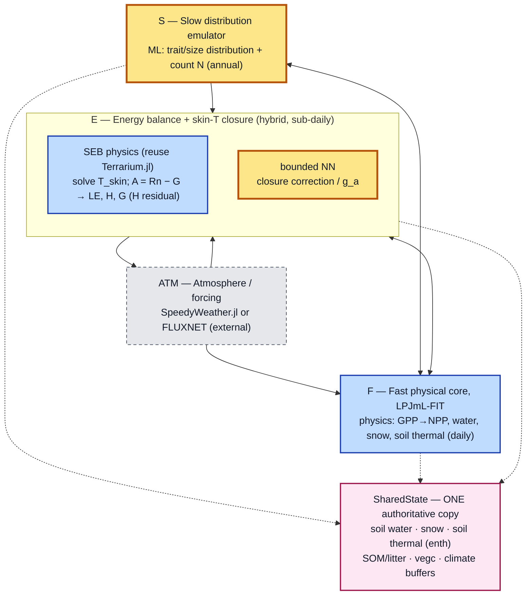
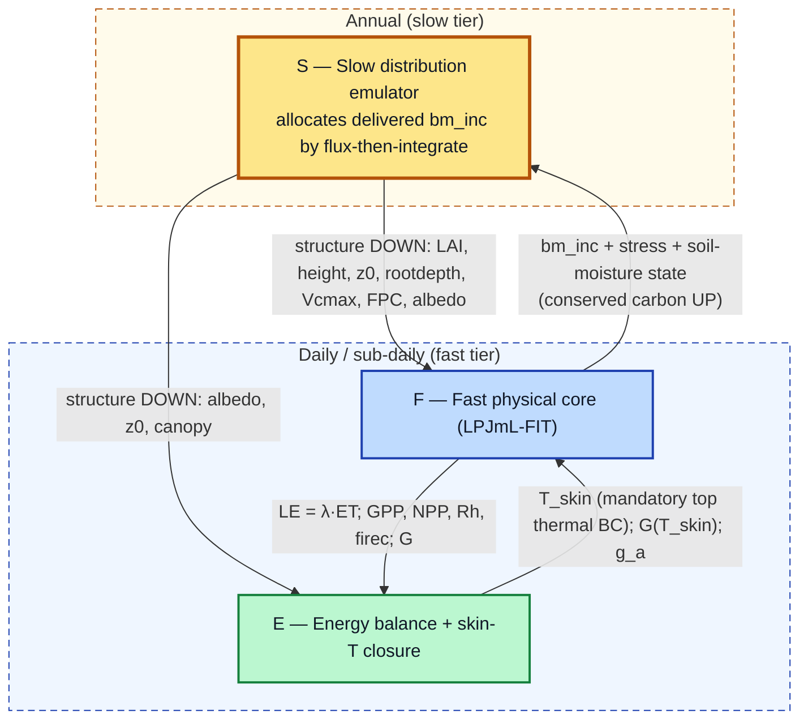
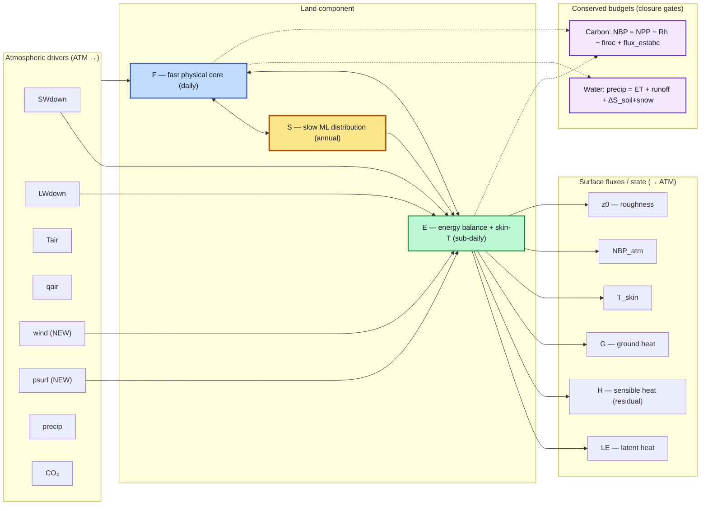
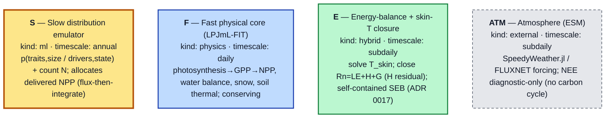
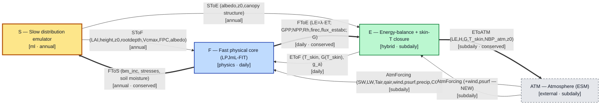

# Diagrams

```@meta
CurrentModule = LPJmLFITEmulator
```

A picture of where every piece sits. There are **two sets** of diagrams, and the governance rule that
resolves the tension between them is the important part (ENGINEERING_STANDARDS §5).

!!! tip "Looking for the complete data flow?"
    The diagrams on this page are **subsystem-level** — the four boxes S / F / E / atmosphere and the
    handoffs between them. For the *full* inventory — every input dataset LPJmL-FIT is driven by, its
    outputs, the derived training tables, the learned artifacts, and what each component reads — see
    [The full data flow](explanation/dataflow.md). That diagram is generated from the same registry and is
    covered by the staleness, reflection, provenance and structure gates described there.

## Governance: curated vs derived

| | **Curated** | **Derived** |
|---|---|---|
| Author | hand-drawn by a human/agent | generated from the code's own registry |
| Purpose | the owner's **mental model** — small, readable | the **source of truth** — always true |
| Source | `docs/src/assets/diagrams/*.mmd` (versioned Mermaid text) | `docs/src/generated/*.mmd`, emitted by `scripts/gen_diagrams.jl` from [`COMPONENTS`](@ref)/[`FLUXES`](@ref) |
| Staleness | possible → caught by the diff alarm | impossible — CI fails on `git diff --exit-code` if the committed copy is stale |

**The rule:** curated diagrams are the owner's mental model; the derived diagrams are the source of
truth and act as a **diff alarm**. `scripts/gen_diagrams.jl` reads the model's own component/flux
registry (`src/registry.jl`) and emits Mermaid to `docs/src/generated/`; CI re-runs it and fails on
`git diff --exit-code` if the committed copy diverged. When the auto-generated graph changes, that is
the signal to update the curated diagrams by hand. We commit diagram **text** (`.mmd`), never rendered
SVG, so diffs stay reviewable.

!!! note "Caveats (ENGINEERING_STANDARDS §5)"
    Mermaid degrades past ~50–100 nodes — keep derived graphs subsystem-level and drop to D2/Graphviz
    for dense views. GitHub's Mermaid does not render C4; use `flowchart`/`architecture-beta`.

## Curated conceptual diagrams (owner-facing)

Authored as versioned Mermaid text under `docs/src/assets/diagrams/`. The fences below are kept in
sync with those files by `scripts/gen_diagrams.jl`, so the page and the `.mmd` cannot drift apart;
a missing source is a hard error rather than a silent gap.

### Components overview — S / F / E and the one shared state

<!-- BEGIN MERMAID curated-components — generated by scripts/gen_diagrams.jl, do not edit -->



<!-- END MERMAID curated-components -->

### Fast ↔ slow coupling (Daily / Annual tiers; the crossing arrows are the shared-state handoffs)

<!-- BEGIN MERMAID curated-coupling — generated by scripts/gen_diagrams.jl, do not edit -->



<!-- END MERMAID curated-coupling -->

### Data / flux flow (input drivers → model → output fluxes, with the conserved budgets)

<!-- BEGIN MERMAID curated-dataflow — generated by scripts/gen_diagrams.jl, do not edit -->



<!-- END MERMAID curated-dataflow -->

## Code-derived diagrams (source of truth)

Emitted by `scripts/gen_diagrams.jl` from the package's own [`COMPONENTS`](@ref) / [`FLUXES`](@ref)
and [`DATA_NODES`](@ref) / [`DATA_EDGES`](@ref) registries (`src/registry.jl`), committed under
`docs/src/generated/`. They cannot drift unnoticed: `test/testitems/diagram_registry_tests.jl`
regenerates them — and the fences on this page — and fails the `CI` gate on any difference.

### Derived — component overview

<!-- BEGIN MERMAID derived-components — generated by scripts/gen_diagrams.jl, do not edit -->



<!-- END MERMAID derived-components -->

### Derived — data-flow graph (conserved handoffs highlighted)

<!-- BEGIN MERMAID derived-dataflow — generated by scripts/gen_diagrams.jl, do not edit -->



<!-- END MERMAID derived-dataflow -->

The same registry underlies the [interface-contract table](explanation/architecture.md) and the
[conservation](explanation/conservation.md) helpers. For the atmosphere/coupling ecosystem this graph
plugs into, see `ECOSYSTEM_AND_COUPLING.md`.
