# The full data flow — every dataset, end to end

```@meta
CurrentModule = LPJmLFITEmulator
```

This page answers three questions in one picture: **what data goes into the original model
(LPJmL-FIT)**, **what data goes into each of the three components** of the emulator, and **what the
components hand to each other**.

It is generated from the code, not drawn by hand. If someone changes what a component reads or
produces, this diagram changes with it, and the test suite refuses to pass until the picture and the
code agree again — see [How it stays true](@ref dataflow-governance) at the bottom.

!!! tip "How to read it"
    - **Solid arrows** move data during an actual simulation.
    - **Thick arrows** are the handoffs where a quantity must be *conserved* — nothing may be created
      or lost in the exchange (carbon, water, energy).
    - **Dashed arrows** never happen during a simulation. They are the offline work: *training* the
      emulator on the original model's output, and *scoring* it against the original model or against
      real-world measurements.
    - Left to right, the picture is a history: raw input data → the original model → its output →
      tables built from that output → the two learned pieces → the running emulator.

## The diagram

```mermaid
%% AUTO-GENERATED by scripts/gen_diagrams.jl — DO NOT EDIT
%% Source of truth: src/registry.jl (COMPONENTS, FLUXES).
%% Regenerate: julia --project=. scripts/gen_diagrams.jl
%% FULL data-flow graph, from src/registry.jl (DATA_NODES, DATA_EDGES, STAGES):
%% input data -> LPJmL-FIT -> derived tables -> learned artifacts -> the coupled
%% S/F/E emulator. Runtime edge labels are REFLECTED from the src/interface.jl
%% structs. Dashed edges are OFFLINE paths (training + validation); they do not
%% run during a coupled simulation.
flowchart LR
    subgraph sg_input["Input data — what drives LPJmL-FIT"]
        direction TB
        GRID["<b>Grid (orderA)</b><br/>67 420 cells at 0.5°, 54 020 tree-bearing; .clm v3 float32"]
        SOILCODE["<b>Soil code</b><br/>1 byte per cell, keys the texture class into par/soil_20m.js"]
        SOILDEPTH["<b>Soil depth (Pelletier)</b><br/>READ THEN DISCARDED — newgrid.c:282 forces every cell to 20 m"]
        CLIM_HIST["<b>Historical climate (obsclim GSWP3-W5E5)</b><br/>daily noleap 1901-2019: tas, pr, rsds, lwnet (net LW), huss"]
        CLIM_SSP["<b>Warming climate (MPI-ESM1-2-HR ssp370)</b><br/>daily 2015-2100, same 5 variables; MIXED .clm versions (huss v3, rest v2 int16 x0.1)"]
        CO2["<b>CO₂ concentration (annual)</b><br/>HELD CONSTANT from 2020 on purpose (ADR 0004); the emulator never sees it (ADR 0107)"]
        PARAMS["<b>Parameter files (.js)</b><br/>lpjmlfit.js, param_lpjmlfit.js, par/pft_lpjmlfit.js, par/soil_20m.js; read via cpp"]
        RESTART["<b>Spin-up-end restart</b><br/>restart_1999.lpj — 1000-yr spin-up state; also carries the per-cell RNG seeds"]
    end
    subgraph sg_input_extra["Extra forcing — the energy balance only (LPJmL-FIT ignores these)"]
        direction TB
        WINDPS["<b>Wind + surface pressure</b><br/>NEW inputs LPJmL-FIT ignores; needed by the energy balance (ADR 0071)"]
    end
    subgraph sg_lpjml["LPJmL-FIT (the C reference model / oracle)"]
        direction TB
        LPJML["<b>LPJmL-FIT v5.6.004</b><br/>individual=true, 25 patches/cell, carbon-only, stochastic gap model (-DPERMUTE)"]
    end
    subgraph sg_truth["LPJmL-FIT output = ground truth"]
        direction TB
        IND["<b>Tree table 'ind' (annual)</b><br/>29 columns per individual; ONLY stems taller than 5 m; 6 significant digits"]
        GFLUX["<b>globalflux (annual)</b><br/>cell carbon + water budget terms — the closure check"]
        DAILY["<b>Daily fields (NetCDF)</b><br/>NPP/GPP, vegc, whc_nat, rootmoist, LAI_STAND, per-PFT daily grass GPP/NPP"]
    end
    subgraph sg_derived["Derived tables (training + per-cell provisioning)"]
        direction TB
        IND_PQ["<b>ind parquet (per seed)</b><br/>frozen 29-column schema, both random seeds = the run-to-run noise floor"]
        CELLFEAT["<b>Cell/year features</b><br/>49 climate/soil/ecology boundary columns per cell and year"]
        SLOWTAB["<b>Runtime-consistent training table</b><br/>one row per cell-year in the SAME order as flux_feature_vector (ADR 0023)"]
        CELLPROV["<b>Per-cell provisioning</b><br/>soil column (whcs, root distribution), starting tree roster, n_init, age0"]
    end
    subgraph sg_artifact["Learned artifacts (versioned, pinned)"]
        direction TB
        DRFART["<b>Count/size forest (.drf)</b><br/>zero-dependency quantile regression forest — how many trees, how big"]
        RCOPART["<b>Recruit-trait copula (.rcop)</b><br/>Gaussian copula over the 4 live trait axes — which trees establish"]
    end
    subgraph sg_runtime["The hybrid emulator at run time"]
        direction TB
        S["<b>S — slow emulator</b><br/>annual: how many trees, of which traits and sizes; allocates the carbon F delivered"]
        F["<b>F — fast physical core</b><br/>daily: photosynthesis, water balance, snow, soil heat; differentiable, conserving"]
        E["<b>E — energy balance + skin temperature</b><br/>sub-daily: solves the surface temperature and closes net radiation = LE + H + G"]
        ATM["<b>Atmosphere</b><br/>offline: tower or reanalysis forcing; online: SpeedyWeather.jl"]
    end
    subgraph sg_obs["Independent observations"]
        direction TB
        OBS["<b>Flux towers (PLUMBER2)</b><br/>9 sites, half-hourly: observed LE, H, net radiation, surface temperature"]
    end
    %% Edges. ==> conserved handoff · -.-> offline (training/validation) path.
    GRID -->|"cell coordinates"| LPJML
    SOILCODE -->|"texture class"| LPJML
    SOILDEPTH -->|"ignored in this config"| LPJML
    CLIM_HIST -->|"5 daily variables<br/>[daily]"| LPJML
    CLIM_SSP -->|"5 daily variables<br/>[daily]"| LPJML
    CO2 -->|"annual, frozen after 2019<br/>[annual]"| LPJML
    PARAMS -->|"PFT + soil parameters"| LPJML
    RESTART -->|"initial state + RNG seeds"| LPJML
    LPJML -->|"one row per tree per year<br/>[annual]"| IND
    LPJML -->|"budget terms<br/>[annual]"| GFLUX
    LPJML -->|"daily fields<br/>[daily]"| DAILY
    IND -.->|"convert + index"| IND_PQ
    IND_PQ -.->|"targets: counts, sizes, traits"| SLOWTAB
    CELLFEAT -.->|"bioclimatic boundary tail"| SLOWTAB
    DAILY -.->|"soil moisture + stand LAI features"| SLOWTAB
    CLIM_HIST -.->|"climate summaries"| CELLFEAT
    CLIM_SSP -.->|"climate summaries"| CELLFEAT
    DAILY -.->|"soil water capacity per layer"| CELLPROV
    IND_PQ -.->|"starting roster + mean age"| CELLPROV
    SLOWTAB -.->|"fit forest"| DRFART
    SLOWTAB -.->|"fit copula"| RCOPART
    DRFART -->|"pinned artifact"| S
    RCOPART -->|"pinned artifact"| S
    CELLPROV -->|"n_init, age0, boundary row"| S
    CELLPROV -->|"soil column + starting canopy"| F
    WINDPS -->|"wind, surface pressure<br/>[daily]"| E
    S -->|"SToF: lai, height, z0, rootdepth, vcmax, fpc, albedo<br/>[annual]"| F
    S -->|"SToE: albedo, z0, lai, height<br/>[annual]"| E
    F ==>|"FToS: bm_inc, water_stress, temp_stress, growth_eff, soilmoist<br/>[annual]"| S
    F ==>|"FToE: le, gpp, npp, rh, firec, flux_estabc, ground_heat<br/>[daily]"| E
    E -->|"EToF: t_skin, ground_heat, g_a<br/>[daily]"| F
    E ==>|"EToATM: le, h, g, t_skin, nbp_atm, z0<br/>[subdaily]"| ATM
    ATM -->|"AtmForcing: swdown, lwdown, tair, qair, wind, psurf, precip, co2<br/>[subdaily]"| F
    ATM -->|"AtmForcing: swdown, lwdown, tair, qair, wind, psurf, precip, co2<br/>[subdaily]"| E
    IND_PQ -.->|"score trees + traits"| S
    DAILY -.->|"score daily fluxes (oracle)"| F
    GFLUX -.->|"score carbon + water closure"| F
    OBS -.->|"score LE, H, surface temperature"| E
    classDef dataset fill:#e0f2fe,stroke:#0369a1,stroke-width:1px,color:#0c4a6e;
    classDef model fill:#dbeafe,stroke:#1e3a8a,stroke-width:3px,color:#111827;
    classDef table fill:#f5f3ff,stroke:#6d28d9,stroke-width:1px,color:#2e1065;
    classDef artifact fill:#fef3c7,stroke:#a16207,stroke-width:2px,color:#111827;
    classDef ml fill:#fde68a,stroke:#b45309,stroke-width:3px,color:#111827;
    classDef physics fill:#bfdbfe,stroke:#1e40af,stroke-width:2px,color:#111827;
    classDef hybrid fill:#bbf7d0,stroke:#15803d,stroke-width:2px,color:#111827;
    classDef external fill:#e5e7eb,stroke:#374151,stroke-width:1px,color:#111827,stroke-dasharray:5 4;
    class GRID dataset;
    class SOILCODE dataset;
    class SOILDEPTH dataset;
    class CLIM_HIST dataset;
    class CLIM_SSP dataset;
    class CO2 dataset;
    class PARAMS dataset;
    class RESTART dataset;
    class LPJML model;
    class IND dataset;
    class GFLUX dataset;
    class DAILY dataset;
    class IND_PQ table;
    class CELLFEAT table;
    class SLOWTAB table;
    class CELLPROV table;
    class DRFART artifact;
    class RCOPART artifact;
    class WINDPS dataset;
    class S ml;
    class F physics;
    class E hybrid;
    class ATM external;
    class OBS dataset;
```

<!-- BEGIN MERMAID derived-dataflow-full — generated by scripts/gen_diagrams.jl, do not edit -->



<!-- END MERMAID derived-dataflow-full -->

It is a large diagram on purpose — it is the *complete* inventory. For the small,
four-box version of just the component coupling, see [Diagrams](../diagrams.md) and
[The three-component architecture](@ref).

## What goes into the original model

LPJmL-FIT is the model this project is learning to imitate, and it is also the source of all training
data. Eight things drive it:

| Input | What it is | Worth knowing |
|---|---|---|
| Grid | 67 420 half-degree land cells; 54 020 of them grow trees | The cell numbering is a specific ordering; two different files on the cluster disagree about it, so they are not interchangeable |
| Soil texture class | One byte per cell, keyed into a soil parameter table | |
| Soil depth | A global soil-depth dataset | **It is read and then thrown away.** The code overwrites every cell with 20 m, so this input has no effect at all |
| Historical climate | Daily air temperature, precipitation, incoming shortwave, net longwave, humidity, 1901–2019 | Observation-based |
| Warming climate | The same five variables from a climate model under a strong-warming scenario, 2015–2100 | This is the out-of-sample test: the emulator must get the *response* to warming right, not just today's world |
| CO₂ concentration | One annual number | **Deliberately frozen** from 2020 onward, and the emulator never sees it at all — see below |
| Parameter files | Plant and soil parameters | Read through the C preprocessor, so the effective value of a parameter is not always what a line in the file appears to say |
| Spin-up state | The state after a 1000-year warm-up, plus each cell's random-number seeds | Every production run continues from here rather than starting from bare ground |

!!! note "Why there is no CO₂ arrow into the emulator"
    The emulator responds to **climate**, not to CO₂ — and that is faithfulness, not a gap. The
    warming scenario's climate already carries the effect of rising CO₂. The original model is run
    with CO₂ held constant on purpose, because with its nitrogen limitation switched off its own
    response to rising CO₂ grows without bound and inflates vegetation carbon. An emulator that
    reproduced that behaviour would be reproducing a known error.

Two further inputs — **wind speed** and **surface pressure** — sit in their own box, because
LPJmL-FIT has no such inputs at all. Only the energy component needs them, and they were sourced
separately from the same observational climate product family.

## What comes out of the original model, and what it is used for

The original model's output plays **two completely different roles**, and the diagram separates them
deliberately:

- **Training data** — the annual tree table (one row per tree per year) becomes, after several
  processing steps, the table the two learned pieces are fitted on.
- **Answer key** — the same outputs, and the daily fields, are what the emulator is *scored*
  against. Both roles are dashed arrows, because neither happens while the emulator runs.

One honest caveat the diagram records: the annual tree table only contains stems **taller than 5 m**,
and writes numbers to six significant digits. Every per-cell statistic derived from it inherits both
limits.

## What goes into each component

Three of the boxes on the right are the emulator itself.

**S — the slow emulator** (annual; the learned part). It decides how many trees there are and what
they are like. It reads:

- the two learned artifacts, pinned to a specific version: a forest model for counts and sizes, and a
  copula for the traits of newly established trees;
- per-cell starting values — an initial tree count, a mean age, and a row of local bioclimate;
- from the fast core each year, the carbon increment it must allocate plus the year's water and
  temperature stresses and the soil moisture state.

Internally, S is conditioned on a fixed-order feature row — four flux drivers from the fast core, six
summaries of this year's stand, last year's tree count, and the bioclimate tail. That order is
load-bearing: it must be *identical* between training and running, or the model is being asked a
different question than it was taught. The function that builds it is
[`flux_feature_vector`](@ref).

**F — the fast physical core** (daily; kept from the original model, made differentiable). It reads
the atmospheric forcing, the canopy structure S derived for it, the surface temperature from the
energy component, and its per-cell soil column.

### Inside F: individual trees, not one average tree

"Reused from LPJmL-FIT" invites a fair question: the original model computes the daily biophysics for
**each individual tree separately** and then adds them up — does ours?

**Yes, for the parts the original does per individual.** The fast core carries the patch's real set of
individuals — a distribution of tree sizes and plant types plus grass — and loops over them. Concretely:

- **Light competition is per individual, and it is vertical.** Tall dominant trees absorb sunlight
  first; suppressed trees below them receive only what is transmitted. Each individual photosynthesises
  on the light *it* actually intercepts.
- **Photosynthesis, respiration and the carbon increment are per individual.** Each tree ends the year
  with its own carbon gain, which is what the slow emulator then allocates.
- **Water demand is stand-level — in the original too.** The original computes one mean canopy
  conductance shared across the whole stand, and each individual transpires the smaller of its own
  water supply and that shared demand, weighted by its share of ground cover. Ours copies that exactly.
  Making this "more per-individual" would be *less* faithful, not more.
- **The soil column is shared** by all individuals in a patch, with total withdrawal capped at each
  layer's available water — again as in the original.

This distinction is not cosmetic. An earlier version of the fast core used a **single representative
tree**, and it was wrong in two directions at once: about 42 % too little photosynthesis and about 45 %
too much transpiration. Both errors came from collapsing the individuals — one over-lit average tree
saturates its own photosynthetic capacity, and it transpires at full-light demand without being scaled
by its ground cover. Moving to the real set of individuals closed both gaps.

!!! warning "Honest simplifications in the current version"
    - Canopy structure is held at its year-end values through the year, with a daily leaf-out factor
      applied — it does not grow continuously within the year.
    - **Trees under 5 m are missing**, because the original model's tree table does not write them out.
    - **Every individual draws water through the same cell-average root profile, rather than its own** —
      see the section below, because this one is not a rounding detail.

    Rainfall interception *is* included: each individual intercepts and evaporates according to its own
    leaf area and plant type, the intercepted water is removed from what infiltrates, and it appears in
    the water-balance closure. (An older source comment listing interception as missing described the
    state before it was added.)

    There is a further dimension above the individual: the original runs **25 independent patches per
    cell** and averages them. Whether the emulator is driven from one representative patch or from the
    whole ensemble measurably changes the levels it reports, so the two are not interchangeable — the
    ensemble is the correct basis, and any single-patch number is biased dense by construction.

### The rooting-depth gap: we predict it, and then do not use it

Worth stating plainly, because it looks like an oversight and is in fact a known, blocked one.

The slow emulator **does** predict a rooting depth per tree — it is one of the trait axes it samples and
one of the axes its accuracy is validated on. But nothing downstream consumes it. The trait sampler
deliberately writes only leaf-area-per-mass and wood density into each tree, because those are the two
the fast core reads; rooting depth is sampled, scored, and then dropped. On the fast side there is no
per-tree rooting field at all, and every individual withdraws water through **one shared cell-average
root profile**. The single rooting-depth number that the slow-to-fast interface does carry is derived
*backwards* out of that shared profile — it is a summary of the average, not a per-tree prediction
flowing in.

So why not simply give each tree its own profile? Because the honest version of that change is a
different piece of physics, and it is currently blocked:

- **The interface has no channel for it.** The slow-to-fast contract carries one rooting number for the
  whole stand. Widening it to a per-tree profile is a change to a frozen contract between two work
  streams, not a local edit.
- **It only bites on the supply side, and that is the blocked part.** Water *demand* is stand-level in
  the original too, so per-tree roots would change only which layers each tree draws *from*. Making that
  faithful means per-individual competitive uptake — trees depleting layers in turn, each capped by what
  is left.
- **The original does that in a randomised order**, re-shuffled daily. That makes it both
  non-deterministic and non-differentiable, and differentiability is a hard requirement for this core.
  A scoping study concluded a faithful port is *structurally impossible* on that path and recommended
  deferring it behind a learned-correction approach instead.

The consequence to keep in mind when reading results: **trait-driven differences in water access are
currently absent from the physics**, even though the trait itself is predicted and validated. Two trees
that differ only in rooting depth behave identically in the water balance. Anything that depends on deep
versus shallow rooting — drought response above all — is therefore not yet represented, and that is a
gap in the science, not just in the code. The design study is `docs/notes/water_supply_perpft_design.md`.

**E — the energy balance** (sub-daily; a closure the original model does not have). It reads the
atmospheric forcing *including wind and pressure*, the canopy structure from S, and the latent and
ground heat from F. It solves for one surface temperature and closes the energy budget, with sensible
heat as the residual.

## What the components exchange

These are the labelled arrows between S, F and E. **The field lists in the diagram are read directly
out of the code** — they are the actual fields of the interface structures in `src/interface.jl`, not
a hand-written summary that could drift.

| Handoff | Carries | Conserved? |
|---|---|---|
| S → F | canopy structure: leaf area, height, roughness, rooting depth, photosynthetic capacity, cover, albedo | no — boundary conditions, not fluxes |
| S → E | albedo, roughness, leaf area, height | no |
| F → S | the annual carbon increment, plus water/temperature stress, growth efficiency, soil moisture | **yes** — S must allocate exactly the carbon F delivered |
| F → E | latent heat, and the four carbon terms E needs | **yes** |
| E → F | the one surface temperature, the matching ground heat, aerodynamic conductance | no |
| E → atmosphere | latent, sensible and ground heat, surface temperature, net land–atmosphere carbon flux, roughness | **yes** |

The rule behind the direction of these arrows: S sends **structure**, F sends **the carbon budget**,
and E owns **the one surface temperature** so that radiation, evaporation and heating all refer to the
same surface.

## [How it stays true](@id dataflow-governance)

The diagram is written by `scripts/gen_diagrams.jl` from [`DATA_NODES`](@ref), [`DATA_EDGES`](@ref)
and [`STAGES`](@ref) in `src/registry.jl`. Four checks in the test suite
(`test/testitems/diagram_registry_tests.jl`) stop it drifting out of agreement with the code:

1. **Staleness.** The diagram is regenerated and compared with the committed copy. Any difference
   fails the build.
2. **Reflection.** The field list on every component-to-component arrow is taken from the interface
   structure itself. Add, rename or remove a field and the diagram changes — and check 1 then fails
   until it is regenerated.
3. **Provenance.** Every input box must name a real entry in `config/paths.yaml`. A dataset that is
   renamed or dropped cannot leave a box on the diagram describing something that no longer exists.
4. **Structure.** No arrow may point at a box that does not exist, no box may be left unconnected, and
   no box may fall outside a drawn group — all three would silently omit information.

To regenerate after changing the model:

```
julia --project=. scripts/gen_diagrams.jl            # rewrite the diagram
julia --project=. scripts/gen_diagrams.jl --check    # just report whether it is stale
```

That command rewrites two things: the diagram file itself, and the diagram block embedded in this
page. Both are covered by check 1, so they cannot fall out of step with each other.

!!! warning "Do not replace the embedded block with an `@eval` block"
    The diagram fences on this page and on [Diagrams](../diagrams.md) sit inside explicit
    `BEGIN MERMAID` / `END MERMAID` comment markers that the generator rewrites. That looks more
    verbose than reading the diagram file in an `@eval` block, and the shorter version **silently
    renders nothing**: the Mermaid plugin converts a diagram fence by matching the *parsed source*,
    while an `@eval` block produces its output later in the same build step — so the fence it returns
    is never converted and appears as raw text in a grey code box. That is precisely how these
    diagrams stayed unrendered for months. After changing anything here, check the built page really
    contains a diagram:

    ```
    grep -c 'class="mermaid"' docs/build/explanation/dataflow.html    # must be > 0
    ```

This closes a real gap. The continuous-integration configuration had claimed for months that the test
suite compared these diagrams against the registry, but no test did — and one of the diagrams had in
fact been silently wrong for weeks. Now the claim is true.
